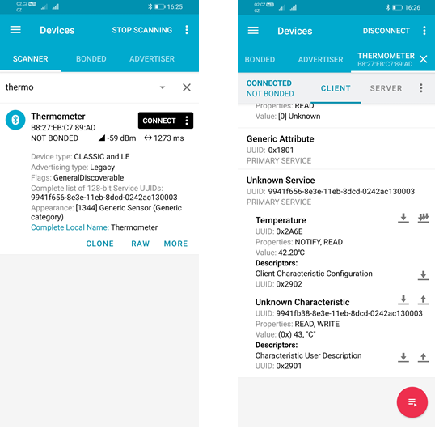

# Overview
This folder contains various implementations of the same Bluetooth peripheral using the Bluetooth adapter available on Raspberry Pi (Pi 3, 4 or Zero W).

## Peripheral as seen by the nRF Connect

